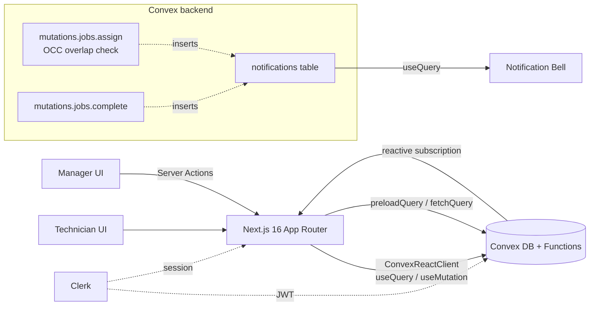

# Brix Scheduling App — Implementation Plan

## Architecture at a glance



**Key insight on conflict prevention.** Convex runs every mutation as a serializable transaction with optimistic concurrency control (read-set tracking + automatic retry). A read-before-write check inside `jobs.assign` (query for any job on the same technician where `existing.start < new.end && existing.end > new.start`) is therefore safe under concurrent manager assignments — Convex will retry on conflict so you cannot get two overlapping jobs even if two managers click "Assign" at the same instant. See [clones/scheduling-app-nextjs-16-sanity-clerk-coderabbit/lib/availability.ts](clones/scheduling-app-nextjs-16-sanity-clerk-coderabbit/lib/availability.ts) lines 159-169 for the half-open overlap test we'll mirror — but executed *inside* a Convex mutation rather than just in a server action.

## Important Next.js 16 specifics

Picked up from `node_modules/next/dist/docs/01-app/01-getting-started/16-proxy.md` and the Calvero clone:

- **Middleware is now `proxy.ts`** at the project root (Next.js 16 rename). Clerk works via `clerkMiddleware()` exported from `proxy.ts`.
- **Dynamic route `params` are async** — `params: Promise<{ id: string }>` then `await params`.
- **Tailwind v4** is already wired (`@import "tailwindcss"` in [app/globals.css](app/globals.css), `@tailwindcss/postcss` plugin in [postcss.config.mjs](postcss.config.mjs)). shadcn `components.json` already exists and uses `style: "radix-sera"` with `baseColor: "taupe"`. We will keep this style.

## Data model (Convex `convex/schema.ts`)

- `users` — `{ clerkId, role: "manager" | "technician", name, email }` with `by_clerk_id` index. Mirrors Clerk on first sign-in via webhook or first-call upsert.
- `quotes` — `{ title, description, customerName, customerAddress, estimatedHours, status: "unscheduled" | "scheduled" | "completed", createdByManagerId, createdAt }` with `by_status` and `by_manager` indexes.
- `jobs` — `{ quoteId, technicianId, managerId, start: number (epoch ms), end: number, status: "scheduled" | "completed", createdAt, completedAt? }` with `by_technician_start` (`["technicianId", "start"]`) for fast overlap queries, plus `by_quote`, `by_manager`.
- `notifications` — `{ userId, kind: "job_assigned" | "job_updated" | "job_completed", jobId, message, readAt?, createdAt }` with `by_user_unread` index.

## Backend-enforced conflict prevention (the core)

`convex/jobs.ts` will export an `assign` mutation:

```ts
// Pseudocode shape
export const assign = mutation({
  args: { quoteId: v.id("quotes"), technicianId: v.id("users"), start: v.number(), end: v.number() },
  handler: async (ctx, { quoteId, technicianId, start, end }) => {
    const me = await requireRole(ctx, "manager");
    if (end <= start) throw new ConvexError("Invalid window");
    if (end - start > 8 * 3600_000) throw new ConvexError("Window too long");

    // Predicate-locking query: only jobs that *could* overlap
    const candidates = await ctx.db
      .query("jobs")
      .withIndex("by_technician_start", q =>
        q.eq("technicianId", technicianId).lt("start", end)
      )
      .collect();
    const conflict = candidates.find(j => j.end > start && j.status !== "completed");
    if (conflict) throw new ConvexError({ code: "OVERLAP", conflictId: conflict._id });

    const quote = await ctx.db.get(quoteId);
    if (!quote || quote.status !== "unscheduled") throw new ConvexError("Quote unavailable");

    const jobId = await ctx.db.insert("jobs", { quoteId, technicianId, managerId: me._id, start, end, status: "scheduled", createdAt: Date.now() });
    await ctx.db.patch(quoteId, { status: "scheduled" });
    await ctx.db.insert("notifications", { userId: technicianId, kind: "job_assigned", jobId, message: `New job: ${quote.title}`, createdAt: Date.now() });
    return jobId;
  },
});
```

`reschedule` and `complete` follow the same pattern; `complete` writes a notification to the manager. Convex's serializable OCC + automatic retry makes the read-then-insert sequence safe under concurrency — no manual locking, no SQL exclusion constraints needed.

Helper file `convex/lib/intervals.ts` exposes `overlaps(aStart, aEnd, bStart, bEnd)` so the same function is reused in client-side preview ("show busy slots before submit").

## UI plan (shadcn + Tailwind v4 + react-big-calendar)

Routes (Next.js 16 App Router with route groups):

- `(auth)/sign-in/[[...sign-in]]` and `sign-up/[[...sign-up]]` — Clerk components
- `(manager)/layout.tsx` — sidebar nav, role-gate to `manager`
  - `dashboard` — KPIs (unscheduled quotes count, jobs today, active technicians)
  - `quotes` — list of quotes with filter (unscheduled/scheduled/completed) + "New Quote" form (shadcn Sheet)
  - `quotes/[quoteId]/assign` — assignment dialog: pick technician (Select), pick date (shadcn Calendar), pick start time (Select with valid times computed from busy windows of the chosen tech), duration default 2h with override (1/2/4h)
  - `technicians/[id]` — read-only week calendar of any technician's schedule
- `(technician)/layout.tsx` — sidebar nav, role-gate to `technician`
  - `schedule` — `react-big-calendar` week+day+agenda views, drag-disabled, jobs as events; click event → side panel with "Mark complete" button
  - `jobs` — flat list view (alternative to calendar)
- Global: `<NotificationBell />` in header, reactive `useQuery(api.notifications.listForMe)` + Sonner toast on new entries

shadcn components to add via CLI: `button` (already there), `card`, `dialog`, `sheet`, `form`, `input`, `textarea`, `select`, `calendar`, `popover`, `badge`, `dropdown-menu`, `sonner`, `tabs`, `separator`, `avatar`, `skeleton`.

`react-big-calendar` styling: import its CSS in [app/globals.css](app/globals.css), then override with Tailwind classes via `eventPropGetter` and a small `<style>` overlay in a `BigCalendar.tsx` wrapper to match the shadcn taupe palette.

## Authentication wiring (Clerk + Convex)

1. `proxy.ts` (root) exports `clerkMiddleware()` with public matchers for `/`, `/sign-in`, `/sign-up`.
2. `app/ConvexClientProvider.tsx` (`"use client"`) wraps with `ConvexProviderWithClerk` from `convex/react-clerk`.
3. `convex/auth.config.ts` declares Clerk as the JWT provider.
4. `convex/users.ts:ensureUser` mutation runs on first authenticated request (called from a tiny client effect) — upserts the user, defaulting role from Clerk `publicMetadata.role`.
5. `convex/lib/auth.ts:requireRole(ctx, role)` throws `ConvexError("Unauthorized")` if the caller is not authenticated or wrong role. Used in every manager/technician mutation.

For the demo we'll seed two managers and three technicians via `convex/seed.ts` (`internalMutation`) called once with `npx convex run seed:run`.

## Notifications (in-app, event-driven via Convex reactivity)

- All writes go through `notifications.create` helper called *inside* the assigning/completing mutation — atomic with the job write.
- `notifications.listForMe` query subscribes the bell to the current user's unread notifications.
- `notifications.markRead` mutation flips `readAt`.
- A small `<NotificationListener />` client component diffs the latest `useQuery` result and pops a Sonner toast for newly-arrived items.

## Files we'll create or change

- New: [convex/schema.ts](convex/schema.ts), [convex/users.ts](convex/users.ts), [convex/quotes.ts](convex/quotes.ts), [convex/jobs.ts](convex/jobs.ts), [convex/notifications.ts](convex/notifications.ts), [convex/seed.ts](convex/seed.ts), [convex/lib/auth.ts](convex/lib/auth.ts), [convex/lib/intervals.ts](convex/lib/intervals.ts), [convex/auth.config.ts](convex/auth.config.ts)
- New: [proxy.ts](proxy.ts) (Clerk middleware)
- New: [app/ConvexClientProvider.tsx](app/ConvexClientProvider.tsx)
- New route groups under [app/](app/) for `(auth)`, `(manager)`, `(technician)` with their pages
- New: [components/calendar/big-calendar.tsx](components/calendar/big-calendar.tsx), [components/notifications/bell.tsx](components/notifications/bell.tsx), [components/forms/assign-job-form.tsx](components/forms/assign-job-form.tsx), [components/forms/quote-form.tsx](components/forms/quote-form.tsx)
- New: shadcn UI components under [components/ui/](components/ui/)
- Edit: [app/layout.tsx](app/layout.tsx) — wrap with `ClerkProvider` + `ConvexClientProvider`, add Sonner `<Toaster />`
- Edit: [app/page.tsx](app/page.tsx) — replace template with landing page that routes to `/dashboard` or `/schedule` based on role
- Edit: [app/globals.css](app/globals.css) — append `react-big-calendar` CSS import + minimal overrides
- Edit: [package.json](package.json) — add `convex`, `@clerk/nextjs`, `convex/react-clerk`, `react-big-calendar`, `date-fns`, `sonner`, `react-hook-form`, `@hookform/resolvers`, `zod`
- New: [.env.local.example](.env.local.example) with the Clerk + Convex keys
- Edit: [README.md](README.md) — full setup, decisions, trade-offs

## Deployment to Vercel

1. Push to GitHub.
2. `npx convex deploy` once locally → get prod deployment URL.
3. Vercel project: set `NEXT_PUBLIC_CONVEX_URL`, `CONVEX_DEPLOY_KEY`, all `NEXT_PUBLIC_CLERK_*` and `CLERK_SECRET_KEY`. Add `Build Command: npx convex deploy --cmd 'next build'` so Convex prod is updated as part of the Vercel build.
4. Configure Clerk JWT template `convex` and paste issuer URL into `convex/auth.config.ts`.

## Trade-offs to capture in README

- **OCC vs queue:** OCC is simple and fits low-write rates; under heavy contention we'd switch to a per-technician queue (linked from [Convex Stack high-throughput patterns](https://stack.convex.dev/high-throughput-mutations-via-precise-queries)).
- **In-app vs email notifications:** chose in-app to stay within scope. Could add Resend via a Convex `internalAction` triggered by the same mutation — design is event-driven by the mutation→action handoff so it's a small extension.
- **react-big-calendar vs custom shadcn grid:** chose RBC for time-saving feature parity (drag, multiple views) at the cost of harder visual control; documented in README.
- **Role storage in Clerk vs Convex:** source of truth in Clerk `publicMetadata`, mirrored to Convex `users` table for fast joins and queries.